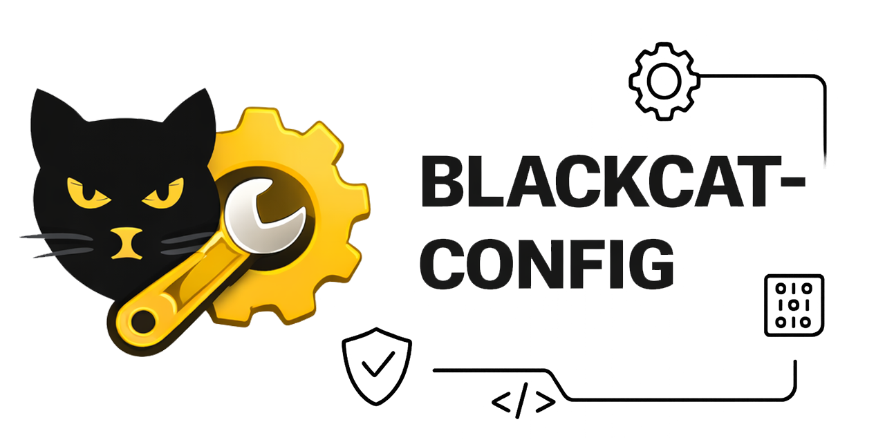

# BlackCat Config

[](https://github.com/blackcatacademy/blackcat-config/actions/workflows/ci.yml)
[](https://github.com/blackcatacademy/blackcat-config/actions/workflows/cli-manifest.yml)

Central configuration and hardening layer for the `blackcatacademy` ecosystem.

This repo is intentionally **security-first**:
- **Fail-closed** defaults (no “env bypass” switches for security-critical paths).
- **File-based runtime config** for environments where `getenv()`/ENV is blocked.
- Permission checks to prevent config/keys path tampering.

## Stage 1: Profiles + CLI

Stage 1 focuses on “profiles” (dev/staging/prod) and operational checks:
- unified `profiles.php` with defaults (env vars, integrations, telemetry sinks),
- `.env` template rendering + profile metadata export,
- security checklist (TLS, required vars, secret placeholders),
- integration checker (required binaries/CLIs),
- telemetry to `var/log/*.ndjson`,
- smoke test (`composer test`) to keep the pipeline stable.

Integrations are intentionally declarative:
- file paths (absolute or relative to the `profiles.php` directory), or
- `blackcat://<command>` references (preferred): a stable pointer to a `blackcat-cli` builtin (avoids hardcoding local paths like `../blackcat-cli/bin/...`).

### CLI

Use `blackcat-cli` (command: `blackcat config …`).

```bash
blackcat config runtime recommend
blackcat config runtime init --force
blackcat config runtime attestation --path=/etc/blackcat/config.runtime.json
```

`blackcat-cli` discovers this component via `blackcat-cli.json` and exposes the builtin `config` command.

No CLI environments:
- `docs/NO_CLI_SETUP.md`

## Stage 2: Runtime config (security core)

Some runtimes block `getenv()`/ENV entirely. Stage 2 provides **file-based runtime config** with strict permission checks:

```php
use BlackCat\Config\Runtime\Config;

Config::initFromJsonFile('/etc/blackcat/config.runtime.json');

$appName = Config::requireString('app.name'); // dot-notation
```

Fail-closed note:
- runtime config file paths must be **absolute** (relative paths are rejected by design).

Path resolution:
- filesystem paths inside the runtime config (e.g. `crypto.keys_dir`, `crypto.manifest`) can be relative,
  but they are resolved **relative to the config file location**, not the process working directory.

Default security rules (POSIX):
- config file must not be a symlink
- config file must not be world-readable / group-writable / world-writable
- config file must be owned by root or the current user (when ownership is available)
- parent directories must not be group/world-writable (sticky dirs like `/tmp` are allowed)

WSL note:
- avoid storing security-critical config on Windows mounts like `/mnt/c` (DrvFS); prefer the WSL filesystem (e.g. `~/.config/blackcat` or `/etc/blackcat`).

Penetration-style tests live in `tests/Security/SecureFileTest.php`.

## Trust model & integrity

Encryption requires a clear trust model (provenance + tamper detection). Design notes:
- `docs/TRUST_MODEL.md`
- `docs/TRUST_KERNEL_EDGEN.md`
- `docs/ROADMAP.md`

## Stage 3: Config discovery helpers

If you need deterministic discovery (without env), use:

```php
use BlackCat\Config\Runtime\Config;

Config::initFromFirstAvailableJsonFileIfNeeded(); // default locations
```

Default candidates are defined in `blackcat-config/src/Runtime/ConfigBootstrap.php` and are platform-specific.

Defaults (summary):
- POSIX: `/etc/blackcat/*.json`, `/run/secrets/*.json`, plus user paths like `~/.config/blackcat/*.json`.
- Windows: `C:\ProgramData\BlackCat\*.json` and `%APPDATA%\BlackCat\*.json` when available.

Discovery behavior:
- if a candidate file exists but is rejected (permissions/symlink/invalid JSON), discovery continues to the next one
- `loadFirstAvailableJsonFile()` reports rejected files in the exception message (diagnostics)

To create a runtime config file in the best available location (auto-recommended), use:

```bash
blackcat config runtime recommend
blackcat config runtime init --force
blackcat config runtime attestation --path=/etc/blackcat/config.runtime.json
```

`runtime:init` creates (or reuses) the first path that can be made valid under strict rules.

## Stage 4+: Runtime crypto config validation

Security-critical crypto settings can be validated before boot:

```php
use BlackCat\Config\Runtime\Config;
use BlackCat\Config\Runtime\RuntimeConfigValidator;

RuntimeConfigValidator::assertCryptoConfig(Config::repo());
```

Validation includes:
- `crypto.keys_dir` is required
- optional `crypto.agent.socket_path` enables **secrets-agent mode** (recommended):
  - key files can be **root-owned** and **not readable** by the web runtime
  - the web runtime reads key material via a local UNIX socket (fail-closed by TrustKernel)
- when `crypto.agent.socket_path` is set, `crypto.keys_dir` is validated best-effort only (do not require runtime readability)
- `crypto.manifest` is optional; public-readable is allowed, but it must not be writable/symlink

Relevant tests:
- `blackcat-config/tests/Security/SecureDirTest.php`
- `blackcat-config/tests/Runtime/RuntimeConfigValidatorTest.php`

## Stage 5: Trust kernel config (Web3 / EVM)

Runtime config keys (recommended baseline):

```json
{
  "crypto": {
    "keys_dir": "/etc/blackcat/keys",
    "agent": {
      "socket_path": "/etc/blackcat/secrets-agent.sock"
    }
  },
  "db": {
    "agent": {
      "socket_path": "/etc/blackcat/secrets-agent.sock"
    },
    "credentials_file": "/etc/blackcat/db.credentials.json"
  },
  "trust": {
    "integrity": {
      "root_dir": "/srv/blackcat",
      "manifest": "/etc/blackcat/integrity.manifest.json",
      "image_digest_file": "/etc/blackcat/image.digest"
    },
    "web3": {
      "chain_id": 4207,
      "rpc_endpoints": ["https://rpc.layeredge.io", "https://edgenscan.io/api/eth-rpc"],
      "rpc_quorum": 2,
      "max_stale_sec": 180,
      "timeout_sec": 5,
      "mode": "full",
      "contracts": {
        "instance_controller": "0xYOUR_INSTALL_INSTANCE_CONTROLLER_CLONE",
        "release_registry": "0x22681Ee2153B7B25bA6772B44c160BB60f4C333E",
        "instance_factory": "0x92C80Cff5d75dcD3846EFb5DF35957D5Aed1c7C5"
      },
      "tx_outbox_dir": "/var/lib/blackcat/tx-outbox"
    }
  }
}
```

Enforcement note:
- Production vs dev behavior must **not** be switchable by editing runtime config.
- In the BlackCat design, enforcement is bound to the **on-chain policy hash** committed in `InstanceController.activePolicyHash`.
  The runtime config may still contain `trust.enforcement` for backwards compatibility, but the trust-kernel runtime in `blackcat-core` does not use it.

Optional additional on-chain attestations (hardening):
- `blackcat.composer.lock.canonical_sha256.v1` (dependency lock provenance)
- `blackcat.php.fingerprint.canonical_sha256.v2` (PHP+extensions fingerprint provenance; stable across worker SAPIs)
- `blackcat.image.digest.sha256.v1` (container image digest provenance)

Notes:
- These optional hardening attestations are typically computed by deployment tooling (e.g. `blackcat-testing` compute output)
  and then set+locked on-chain via `blackcat trust tx:*`.

DB note:
- In TrustKernel deployments, do not store `db.dsn` / `db.user` / `db.pass` in runtime config.
- Store DB credentials in a root-only file (e.g. `/etc/blackcat/db.credentials.json`) and expose them via a privileged local agent (UNIX socket),
  so the agent can enforce TrustKernel read/write permissions before releasing credentials.

PHP runtime hardening gate (strict mode):
- In strict policy (bound to the on-chain `activePolicyHash`), `blackcat-core` will fail-closed if critical PHP_INI_SYSTEM settings are unsafe.
- In warn/dev policy it emits loud warnings but does not block.
- Required examples for strict mode (configure via `php.ini` / `conf.d`, not runtime):
  - `allow_url_include=0`
  - `phar.readonly=1`
  - `open_basedir` must be set (include your app root + runtime config dirs)
  - `disable_functions` should include: `exec,shell_exec,system,passthru,popen,proc_open,pcntl_exec`
  - ensure Web3 transport exists (recommended: install `ext-curl`; optional: disable `allow_url_fopen` to reduce SSRF surface)

Defaults and rules:
- `max_stale_sec` recommended production default is `180` (fail-closed after stale).
- RPC endpoints must be `https://` (plain HTTP is allowed only for localhost).
- production should use at least 2 independent RPC endpoints (`rpc_quorum >= 2`) to reduce single-endpoint trust.
- `rpc_quorum` must be in `1..count(rpc_endpoints)`.
- `trust.integrity.root_dir` must be an absolute, readable directory and must not be writable by group/world.
- `trust.integrity.manifest` must be an absolute, readable file and must not be writable or a symlink.
- `trust.web3.tx_outbox_dir` should be writable for buffering tx intents, but never world-writable (example: `root:www-data 0770`).

Validate Web3 trust-kernel config:

```php
use BlackCat\Config\Runtime\Config;
use BlackCat\Config\Runtime\RuntimeConfigValidator;

Config::initFromFirstAvailableJsonFile();
RuntimeConfigValidator::assertTrustKernelWeb3Config(Config::repo());
```

Edgen Chain template:
- `blackcat-config/docs/TRUST_KERNEL_EDGEN.md`
  - use `blackcat config runtime init` to create a secure file, then fill it using the JSON template in that doc
  - use `blackcat config runtime attestation` + `blackcat trust tx:controller-attest-runtime-config` to set+lock policy v3+ commitments

## Stage 6: Source code policy scan (anti-bypass)

This repo provides scanning primitives, but the CLI surface is provided by `blackcat-cli`.
